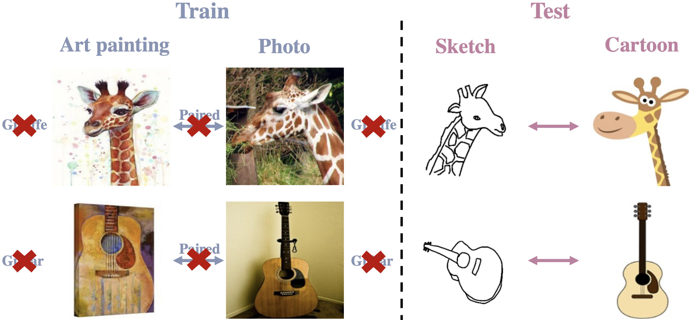

# Unsupervised Feature Representation Learning for Domain-generalized Cross-domain Image Retrieval

This repository contains the PyTorch implementation for our ICCV2023 paper "[Unsupervised Feature Representation Learning for Domain-generalized Cross-domain Image Retrieval](https://openaccess.thecvf.com/content/ICCV2023/papers/Hu_Unsupervised_Feature_Representation_Learning_for_Domain-generalized_Cross-domain_Image_Retrieval_ICCV_2023_paper.pdf)".



Cross-domain image retrieval has been extensively studied due to its high practical value. In recently proposed unsupervised cross-domain image retrieval methods, efforts are taken to break the data annotation barrier. However, applicability of the model is still confined to domains seen during training. This limitation motivates us to present the first attempt at domain-generalized unsupervised cross-domain image retrieval (DG-UCDIR) aiming at facilitating image retrieval between any two unseen domains in an unsupervised way. To improve domain generalizability of the model, we thus propose a new two-stage domain augmentation technique for diversified training data generation. DG-UCDIR also shares all the challenges present in the unsupervised cross-domain image retrieval, where domain-agnostic and semantic-aware feature representations are supposed to be learned without external supervision. To accomplish this, we introduce a novel cross-domain contrastive learning strategy by utilizing phase image as a proxy to mitigate the domain gap. Extensive experiments are carried out using PACS and DomainNet dataset, and consistently illustrate the superior performance of our framework compared to existing state-of-the-art methods.

## Download
### Datasets
* [PACS Dataset](https://drive.google.com/drive/folders/0B6x7gtvErXgfUU1WcGY5SzdwZVk?resourcekey=0-2fvpQY_QSyJf2uIECzqPuQ)
* [DomainNet Dataset](http://ai.bu.edu/M3SDA/)
### Pre-trained model
* [MoCo v2 model](https://github.com/facebookresearch/moco): Download the MoCo v2 model trained after 800 epochs.

## Running
You can modify line 15-16 in ./scripts/train.sh accordingly to train with the selected domain pair:
```
CUDA_VISIBLE_DEVICES=0 ./scripts/train.sh
```

## Citation
If you find our work helpful to your reseach, please cite our paper:
```
@inproceedings{hu2023unsupervised,
  title={Unsupervised Feature Representation Learning for Domain-generalized Cross-domain Image Retrieval},
  author={Hu, Conghui and Zhang, Can and Lee, Gim Hee},
  booktitle={Proceedings of the IEEE/CVF International Conference on Computer Vision},
  year={2023}
}
```